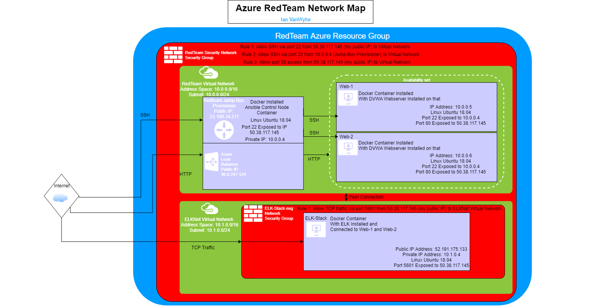
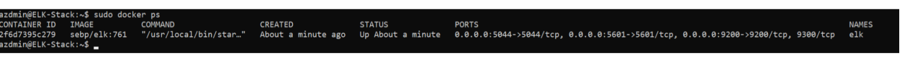

# drawling-daemon
## Automated ELK Stack Deployment

The files in this repository were used to configure the network depicted below.

These files have been tested and used to generate a live ELK deployment on Azure. They can be used to  recreate the entire deployment pictured above. Alternatively, different playbook files may be used to install only certain pieces of it, such as Filebeat. The necessary playbooks are install-elk-playbook.yml, filebeat-playbook.yml, metricbeat-playbook.yml, and install-dvwa-playbook.yml.

This document contains the following details:
- Description of the Topology
- Access Policies
- ELK Configuration
  - Beats in Use
  - Machines Being Monitored
- How to Use the Ansible Build

### Description of the Topology

The main purpose of this network is to expose a load-balanced and monitored instance of DVWA, the D*mn Vulnerable Web Application.

Load balancing ensures that the application will be highly available, in addition to restricting access to the network.

Integrating an ELK server allows users to easily monitor the vulnerable VMs for changes to the system logs and system metrics.

The configuration details of each machine may be found below.

| Name                 | Function         | IP Address | Operating System   |
|----------------------|------------------|------------|--------------------|
| Jump Box Provisioner | Gateway          | 10.0.0.4   | Linux Ubuntu 18.04 |
| Web-1                | DVWA Web Server  | 10.0.0.5   | Linux Ubuntu 18.04 |
| Web-2                | DVWA Web Server  | 10.0.0.6   | Linux Ubuntu 18.04 |
| ELK-Stack            | ELK Stack Server | 10.1.0.4   | Linux Ubuntu 18.04 |

### Access Policies

The machines on the internal network are not exposed to the public Internet.

Only the Jump Box and ELK-Stack machines can accept connections from the Internet. Access to these machines is only allowed from the following IP address: 50.38.117.145

Machines within the network can only be accessed by SSH from the Jump Box, IP address of 10.0.0.4.

A summary of the access policies in place can be found in the table below.

| Name      | Publicly Accessible | Allowed IP Addresses   |
|-----------|---------------------|------------------------|
| Jump Box  | Yes                 | 50.38.117.145          |
| Web-1     | No                  | 10.0.0.4               |
| Web-2     | No                  | 10.0.0.4               |
| ELK-Stack | Yes                 | 50.38.117.145 10.0.0.4 |

### Elk Configuration

Ansible was used to automate configuration of the ELK machine. No configuration was performed manually, which is advantageous because it allows for deployment of identical environments to multiple machines and reduces the possibility for human error.

The install-elk playbook implements the following tasks:
- Installs docker.io
- Installs python3-pip
- Installs Docker pip module
- Expands virtual memory available to the ELK stack.
- Downloads and installs a Docker ELK container.
- Enables Docker service on boot.

The following screenshot displays the result of running `docker ps` after successfully configuring the ELK instance.

### Target Machines & Beats
This ELK server is configured to monitor the following machines:
- Web-1: 10.0.0.5
- Web-2: 10.0.0.6
- Load Balancer Public IP: 40.83.247.124

We have installed the following Beats on these machines:
- Filebeat
- Metricbeat

These Beats allow us to collect the following information from each machine:
- Filebeat collects and centralizes log data, which allows us to easily monitor logs for unexpected changes.
- Metricbeat collects and centralizes system metrics, allowing us to easily monitor for suspicious uses of system resources.

### Using the Playbook
In order to use the playbook, you will need to have an Ansible control node already configured. Assuming you have such a control node provisioned:

SSH into the control node and follow the steps below:
- Copy the install-elk-playbook.yml, filebeat-playbook.yml, and metricbeat-playbook.yml files to /etc/ansible/roles (the roles folder may need creating first). Copy the filebeat-config.yml and metricbeat-config.yml files into the /etc/ansible/roles/files folder (the files folder may also need creating first). 
- Update the Ansible hosts file to include the internal IP address of the machine that is to have the ELK stack installed under the [elk] host group, followed by "ansible_python_interpreter=/usr/bin/python3", and the internal IP addresses of the web servers to host filebeat and metricbeat under the [webservers] host group.
- Update the filebeat-config.yml file: Scroll to line #1106 and replace the IP address with the IP address of your ELK machine. Then scroll to line #1806 and replace the IP address with the IP address of your ELK machine.
- Update the shorter metricbeat-config.yml files: Scroll to lines 62 and 95 and replace the IP addresses with the IP address of your ELK machine.
- Run the playbook files starting with install-elk, and navigate to "[Server Public IP]:5601/app/kibana" (for me, this would be "52.191.175.133:5601/app/kibana") to check that the installations worked as expected.

****
